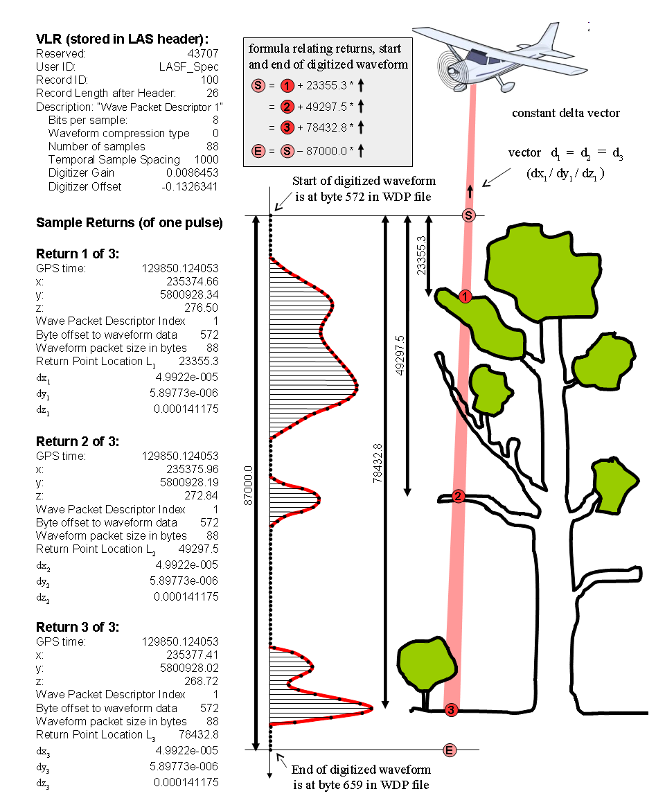

# Project: document [3D printable Geographic Elevation map](https://docs.google.com/document/d/10M-8PcTnYrfr516UjfdYd96LrkGRG_HbM2IogDypXgw/edit?usp=sharing)

## DEM to Mesh conversion : Landscapes transformation to 3D sample object

We have to create a 3D image of terrain from an array of 2D elevation values.The goal is to take an elevation map as input (meaning a grid with elevation data, as the usage of ones). We will generate a file that is printable by 3D printer. The output could be STL or an OBJ file, these file formats are used for 3D printing.

## Raster data [DEM, DTM : GeoTIFF](https://gisgeography.com/dem-dsm-dtm-differences/)



### Environment setup

Python v3.6 with [ANACONDA](https://docs.conda.io/en/latest/miniconda.html)

```bash
conda create --name m2m python=3.6
conda activate m2m
conda install -c conda-forge whitebox_tools
conda install --channel conda-forge geopandas
conda install --channel conda-forge spaghetti
pip install --use-feature=2020-resolver git+git://github.com/ozak/georasters.git
conda install rasterio
pip install earthpy
conda install -c conda-forge gdal
conda install -c conda-forge pdal python-pdal
conda install -c conda-forge trimesh
conda install -c conda-forge laspy
conda install -c open3d-admin open3d
conda install -c conda-forge meshio
pip install git+https://github.com/rougier/matplotlib-3d
conda install Pillow
conda install -c conda-forge vtk PyQt5
conda install -c conda-forge pyside2
pip install -r requirements.txt
```

## Execution CLI

Run the command with Anaconda envronment enabled.

Demo DATA from Earth - Moon explorer mission
"data/DEM/MOON/ulcn2005_lpo_dd0/ulcn2005_lpo_dd0.tif"

```bash
conda activate m2m && python main.py
```

### Apps paramaters

- Sourcefile :help='Your GeoTiFF sourcefile path, relative or absolute.'
- Quality type=float, default=1, help='The resolution of the resulting BMP. 1 will match the source resolution.'
- Vsize', type=float, default=1, help='Height of DEM in the output in arbitrary units.'
- Clip Max, type=float, default=CMAX, help='Clip input data to this maximum value.'
- Clip Min, type=float, default=CMIN, help='Clip input data to this minimum value.'
- Base', type=float, default=0, help='Add this value in arbitrary units everywhere to make a thicker base.'
- Hsize', type=float, default=1.0, help='Width of the narrowest axis of the piece in arbitrary units.'
- Hsep', type=float, default=0, help='Separation distance between stacked DEMs in arbitrary units.'
- Sdep', type=float, default=0.1, help='Depth of separator between stacked DEMs.'
- Tdep', type=float, default=0.3, help='Depth of separator tabs between stacked DEMs.'
- Tsize', type=float, default=0.3, help='Size of tabs between stacked DEMs.'
- Asize', type=float, default=0.75, help='Size of the anchor material on the end.'

### User Tips

the GeoTIFF file can be drag from File manager GUI and drop on the terminal for get the absolute FS paths exactly.

## Using libraries

- [GeoPandas](https://geopandas.org/data_structures.html)
- [PySAL Spagetti](http://pysal.org/notebooks/explore/spaghetti/intro.html)
- [matplotlib-3d](https://github.com/rougier/matplotlib-3d), [PyOpenGL](http://pyopengl.sourceforge.net/) : for 3d axis Visualization
- [MESHIO](https://github.com/nschloe/meshio), Trimesh : for meshed 3D data
- [GDAL](https://anaconda.org/conda-forge/gdal) for raster data
- [PDAL](https://anaconda.org/conda-forge/pdal) for points cloud data
- [LASPY](https://github.com/laspy/laspy): for LAS, LAZ files
- [WhiteboxTools](https://jblindsay.github.io/ghrg/WhiteboxTools/) for GIS DEM transformations

## Working file formats

- [VTK is an open-source software system for image processing, 3D graphics, volume rendering and visualization.](https://vtk.org/doc/nightly/html/index.html)
- .tif [GeoTIFF](https://earthdata.nasa.gov/esdis/eso/standards-and-references/geotiff):
  open with the IDE Quantum GIS [QGIS](http://www.qgis.org/)
- .laz (Compressed LAS) , .las (LAS):
  open with the IDE [CloudCompare](https://www.cloudcompare.org/)
- .obj (Wavefront OBJ), .ply (Stanford Triangle Format):
  open with the IDE [GMSH](http://gmsh.info/), [MeshLab](http://www.meshlab.net/)

### Based the works of Dr.Richard Barnes

on the project [DEM to 3D](https://github.com/r-barnes/DEMto3D)

## Sugested open data sources

- [Extraterrestrial planets map by USG](https://www.usgs.gov/centers/astrogeology-science-center/science/mrctr-gis-lab)
- [Earth map by USGS](https://earthexplorer.usgs.gov/)
- [OpenTopography](https://opentopography.org/blog/demand-3d-topographic-differencing)

## Contacts team members

Date: May 4, 2020
Bordeaux Université
Master Informatique 2019

- Nguyen Vu Anh Trung (kivanolai@gmail.com)
- Tran Quang Tung (quangtung0276@yahoo.com)
- Nguyen Quoc Khanh (qkhanh2006@gmail.com)
